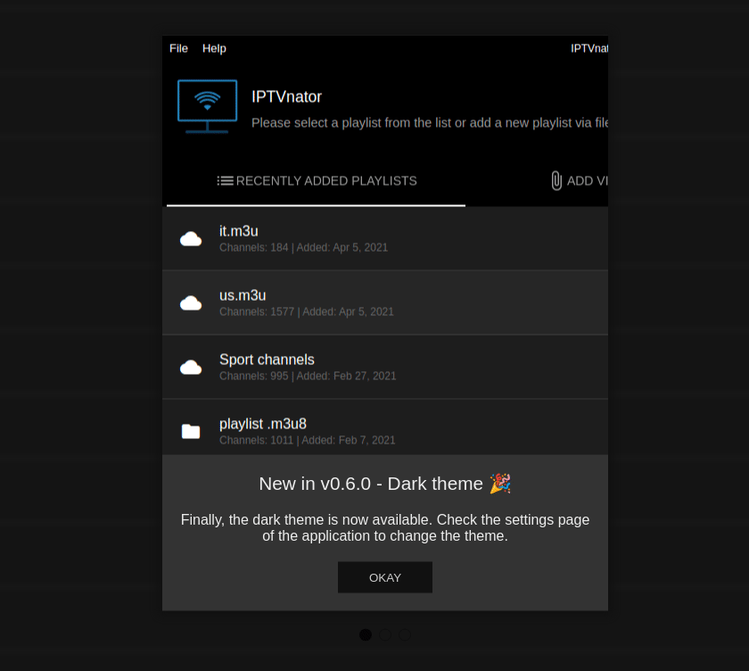

# NgxWhatsNew

Ngx-whats-new is an angular module with a multi-modal component that is typically used to present new features of your application.



```
    npm i ngx-whats-new
```

## Usage example:

[Codesandbox example](https://codesandbox.io/s/ngx-whats-new-demo-nxc8b?file=/src/main.ts)

Import the module:

```
    import { NgModule } from '@angular/core';
    import { NgxWhatsNewModule } from 'ngx-whats-new';
    import { AppComponent } from './app.component';

    @NgModule({
    declarations: [AppComponent],
    imports: [NgxWhatsNewModule],
    bootstrap: [AppComponent],
    })
    export class AppModule {}
```

Use `<ngx-whats-new>` in your component:

app.component.html

```
    <button (click)="openDialog()">Open Dialog</button>
    <ngx-whats-new
        *ngIf="isDialogVisible"
        (closeModal)="closeDialog()"
        [items]="modals"
        [options]="options"
    >
    </ngx-whats-new>
```

app.component.ts

```
    /** initial state of the modal */
    isDialogVisible = true;
    /** global options */
    options = {
        disableClose: true,
        customStyle: {
        width: '500px',
        borderRadius: '10px',
        boxShadow: '0px 0px 10px 5px #999',
        },
    };
    /** definition of all modals to show */
    modals = [
        {
        imageHeight: 500,
        imageSrc: 'https://placeimg.com/500/500/arch',
        title: 'What is new in 5.0',
        text:
            'Lorem ipsum dolor sit amet, consectetur adipiscing el aspect et just.',
        html: 'Hello <b>world!</b>',
        button: {
            text: 'Okay',
            textColor: '#fff',
            bgColor: '#333',
        },
        },
        {
        text:
            'Lorem ipsum dolor sit amet, consectetur adipiscing el aspect et just. Spsum dolor sit amet, consectetur adipiscing el aspect et just',
        button: {
            text: 'Got it!',
            textColor: '#fff',
            bgColor: '#333',
        },
        },
  ];
```

## Available Options:

General options:

```
    export interface Options {
        disableClose?: boolean;
        enableKeyboardNavigation?: boolean;
        clickableNavigationDots?: boolean;
        customStyle: {
            width?: string;
            boxShadow?: string;
            borderRadius?: string;
            borderSize?: string;
        }
    }
```

Options of a single modal window:

```
    export interface ModalWindow {
        imageSrc?: string;
        text: string;
        imageHeight?: string;
        imageBgColor?: string;
        button?: {
            text: string;
            textColor: string;
            bgColor: string;
            position: string;
        };
    }
```
